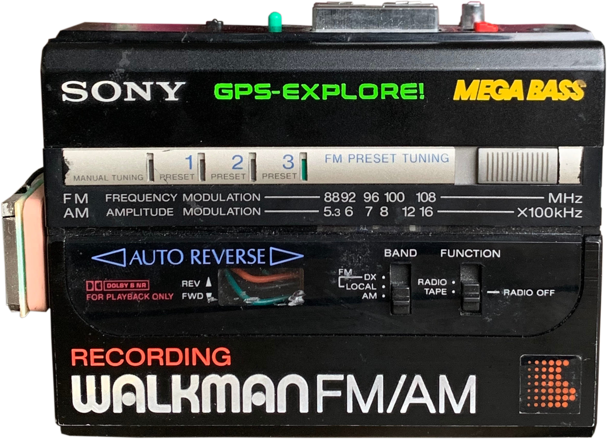

# GPS-EXPLORE
A personal geo caching device built into a recycled Walkman, but the caches are sound files. A project built for a loved one.

   ### GPS data Notes:
      S and W are negative values
      I am using decimal degrees notation
      To fetch country GPS boundary relation number: https://nominatim.openstreetmap.org/
      To fetch country GPS boundary data polygon:http://polygons.openstreetmap.fr/index.py

   ### MP3 setup notes:
      The micro SD card should be formatted as FAT16 or FAT32
      Songs must be prefixed with a unique 3 digit index number
      MD_YX5300 library documentation: https://majicdesigns.github.io/MD_YX5300/class_m_d___y_x5300.html

   I am using the point inclusion in polygon test, following is the copyright licence to give due credit to the original creator.
   https://wrf.ecse.rpi.edu/Research/Short_Notes/pnpoly.html - Point Inclusion in Polygon Test W. Randolph Franklin (WRF)

        > Copyright (c) 1970-2003, Wm. Randolph Franklin

        >Permission is hereby granted, free of charge, to any person obtaining a copy of this software and associated
        documentation files (the "Software"), to deal in the Software without restriction, including without limitation
        the rights to use, copy, modify, merge, publish, distribute, sublicense, and/or sell copies of the Software, and
        to permit persons to whom the Software is furnished to do so, subject to the following conditions:

        Redistributions of source code must retain the above copyright notice, this list of conditions and the following disclaimers.
        Redistributions in binary form must reproduce the above copyright notice in the documentation and/or other materials provided with the distribution.
        The name of W. Randolph Franklin may not be used to endorse or promote products derived from this Software without specific prior written permission.
        THE SOFTWARE IS PROVIDED "AS IS", WITHOUT WARRANTY OF ANY KIND, EXPRESS OR IMPLIED, INCLUDING BUT NOT LIMITED TO THE WARRANTIES OF MERCHANTABILITY,
        FITNESS FOR A PARTICULAR PURPOSE AND NONINFRINGEMENT. IN NO EVENT SHALL THE AUTHORS OR COPYRIGHT HOLDERS BE LIABLE FOR ANY CLAIM, DAMAGES OR OTHER
        LIABILITY, WHETHER IN AN ACTION OF CONTRACT, TORT OR OTHERWISE, ARISING FROM, OUT OF OR IN CONNECTION WITH THE SOFTWARE OR THE USE OR OTHER DEALINGS
        IN THE SOFTWARE. *

